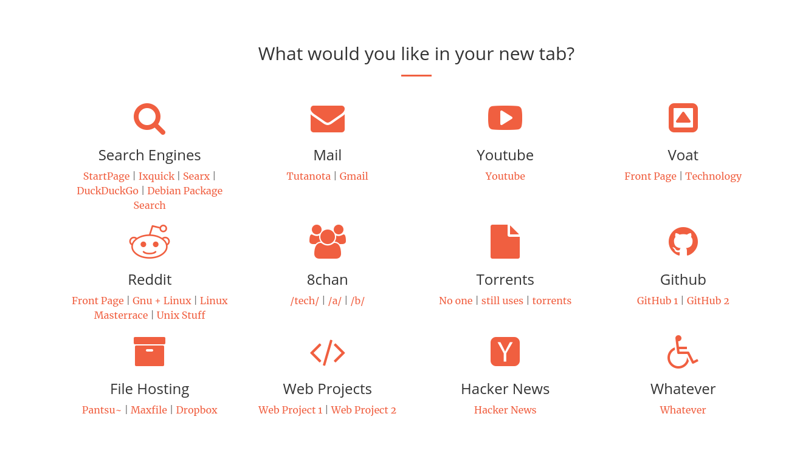

# New Tab

---

Please note that this is now depreciated since modern browsers do not allow access to local files. You can use the add-on [New Tab Override](https://addons.mozilla.org/en-US/firefox/addon/new-tab-override/), but it will not load local CSS files.

This is an example page for when you open a new tab in your browser. Nothing more, nothing less.

